<p align="center">
<a href="https://www.meraki-academy.org" target="_blank" rel="noopener noreferrer">
 
 </a>
</p>

<h3 align="center">QuickServ
</h3>

---

<p align="center"> An Application for Delivering Multiple Products Simultaneously 
    <br> 
<a href='https://quickserv.netlify.app'>Demo</a>
    <br> 
</p>

## 📝 Table of Contents

- [About](#about)
- [Getting Started](#getting_started)
- [Usage](#usage)
- [Built Using](#built_using)
- [User Story](#user_story)
- [Data Flow](#data_flow)
- [Guided By](#guided_by)

## 🧐 About <a name = "about"></a>

Are you looking for a fast and efficient way to deliver multiple products at the same time? QuickServ is the ultimate solution for streamlined deliveries, ensuring that your customers receive their orders promptly and accurately. This application is designed to help you manage and coordinate the delivery of various products, all in one go, saving you time and effort.

## 🏁 Getting Started <a name = "getting_started"></a>

These instructions will get you a copy of the project up and running on your local machine for development and testing purposes.

### Prerequisites

- Visual Studio Code follow this <a href='https://code.visualstudio.com/download'>link</a> to install.
- Git Bash follow this <a href='https://git-scm.com/downloads'>link</a> to install.
- Create an account on Neon by following this <a href='https://neon.tech/'>link</a>.
- Node.js follow this <a href='https://nodejs.org/en'>link</a> to install.

### Installing:

1. Clone the repo to your local machine using git bash.

```
git clone https://github.com/TechonomicsProjectTeam/MERAKI_Academy_Project_5.git
```
2. Create a .env file in the root directory of the backend folder. Use the following format, replacing the placeholder values with your own credentials:

```
DB_URL="your_postgresql_connection_string"
SECRET="your_secret_key"
SALT=your_salt_value
PORT=5000
clientId="your_google_client_id"
clientSecret="your_google_client_secret"
redirectUri="http://localhost:3000"
paypalClientId="your_paypal_client_id"
paypalSecret="your_paypal_secret"
REACT_APP_GOOGLE_API_KEY="your_google_api_key"
TWILIO_AUTH="your_twilio_auth_token"
TWILIO_NUM="your_twilio_auth_number"
TWILIO_NUMBER="your_twilio_phone_number"

```
### Note:
Please ensure that you create a `.env` file in the root directory of the backend folder and fill it with your own credentials. Do not share your `.env` file publicly, as it contains sensitive information.


3. Install packages in both the backend and frontend folders by running the following command in each directory:

```
npm i //Or npm i --force 
```

4. Run server using git bash inside backend folder

```
npm run dev
```

5. Run application using git bash inside frontend folder

```
npm run start
```

Now app ready to use

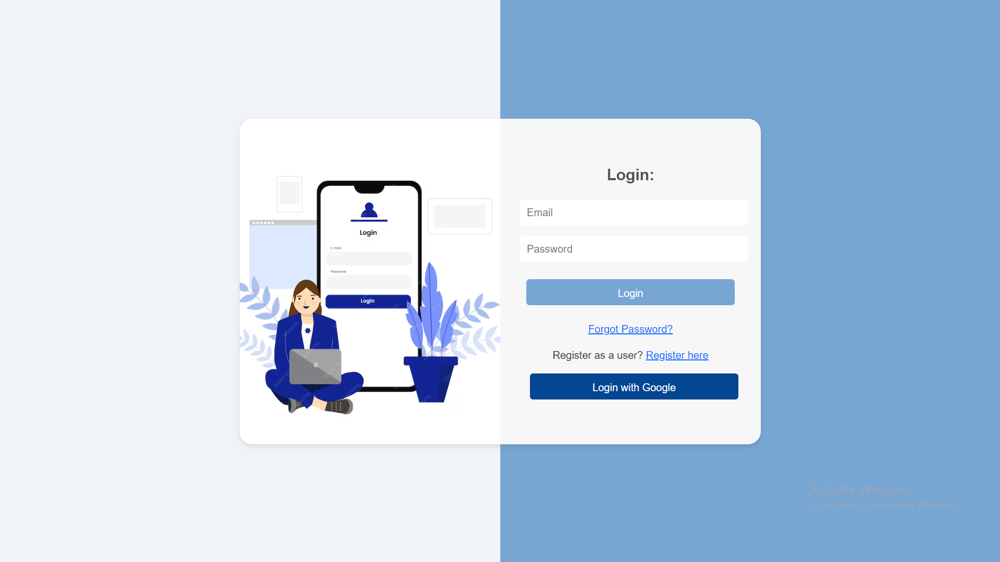

## 🎈 Usage <a name="usage"></a>

- You have to **register first** to navigate our web app. 

- You can register as a **User** or **Driver** like in the image below.
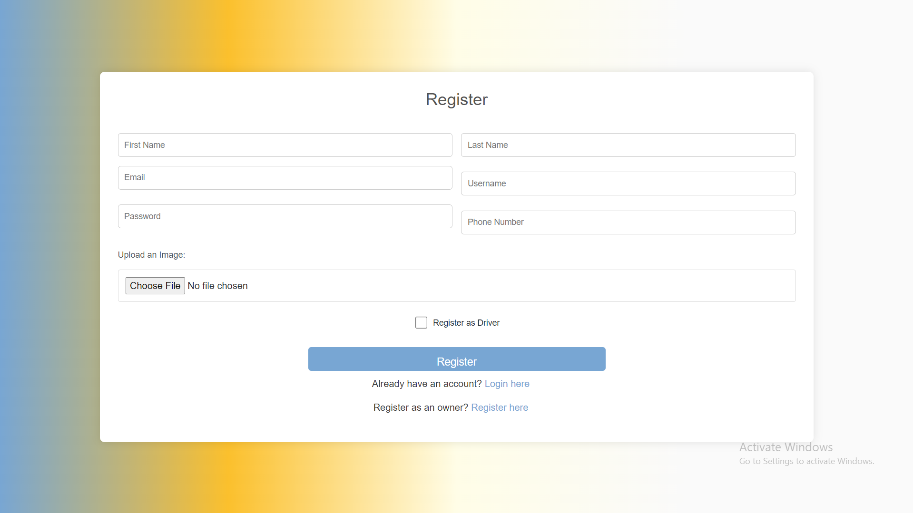
- Or you can register as an **Owner** as shown in the image below.

- After registering, you can navigate through our categories from the **User Dashboard** to explore what categories we offer.
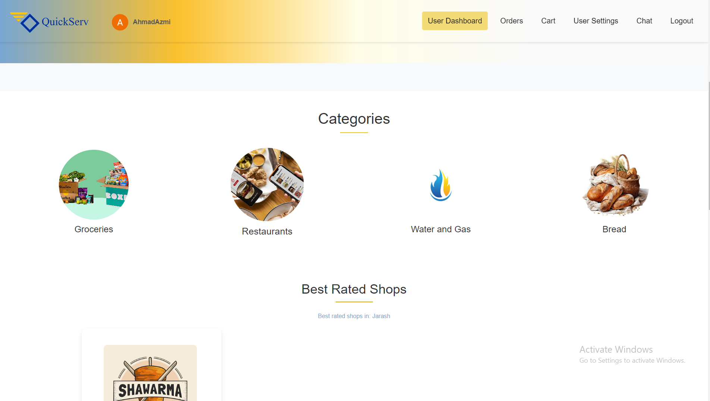
- You can then browse through each category's shops and rate every shop.
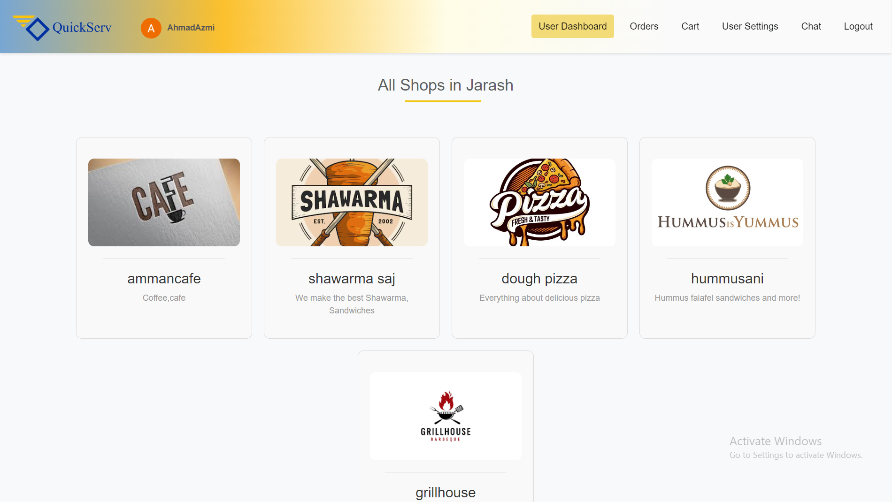
- Within each shop, you can view all available products. 
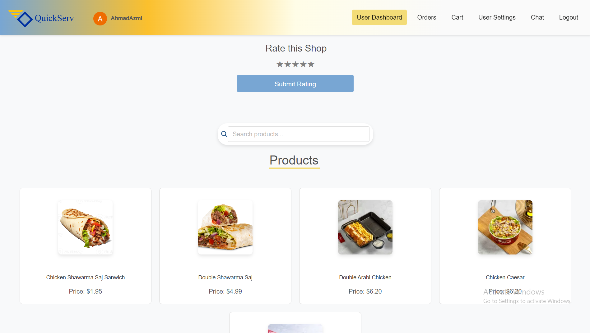
- Here, you can add a review or rating, or you can add the product to your cart.
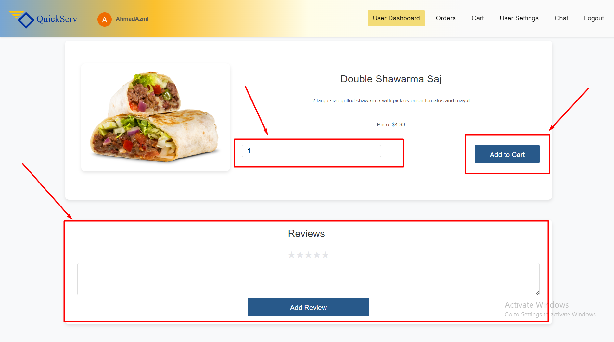
- In the cart section, you can see what your cart looks like. You can adjust the quantity of products, remove them, or proceed to order the items in your cart.
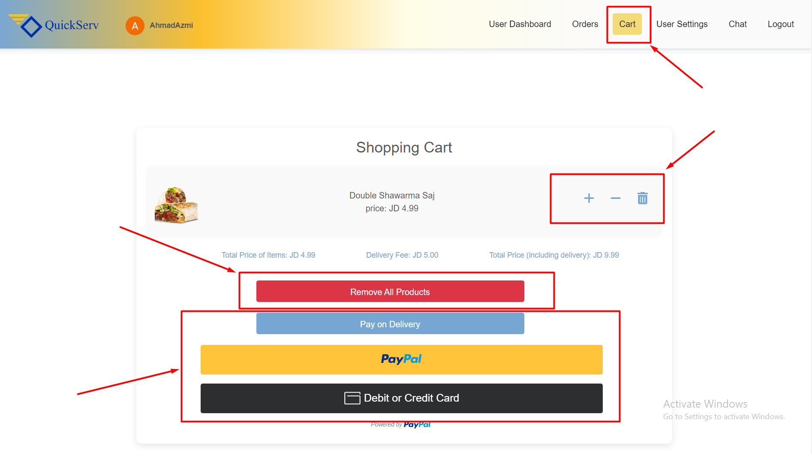
- You can view your orders status and see who has accepted them.
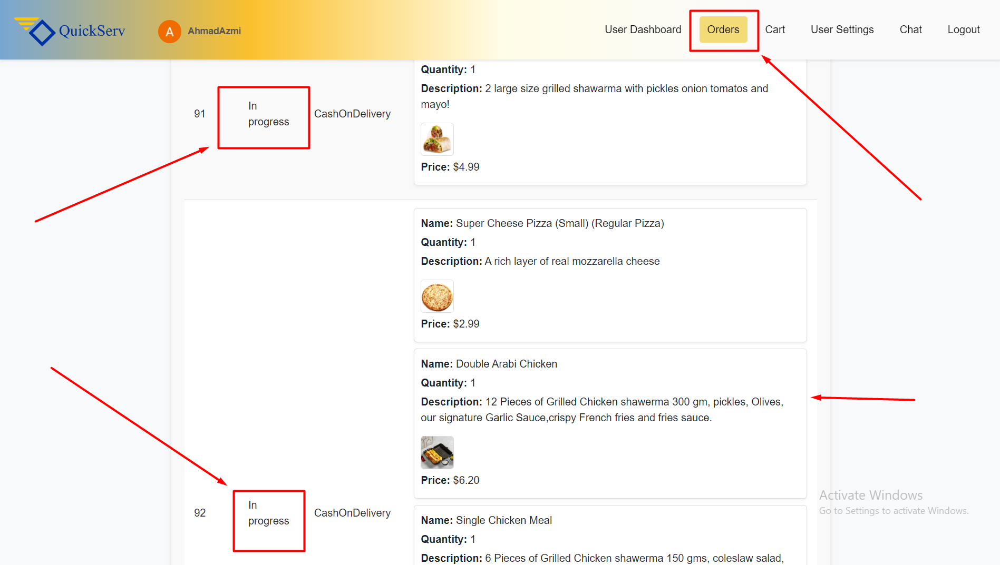
- On the **Driver Dashboard**, you can accept any user's order, see who the user is, and how many products they have.
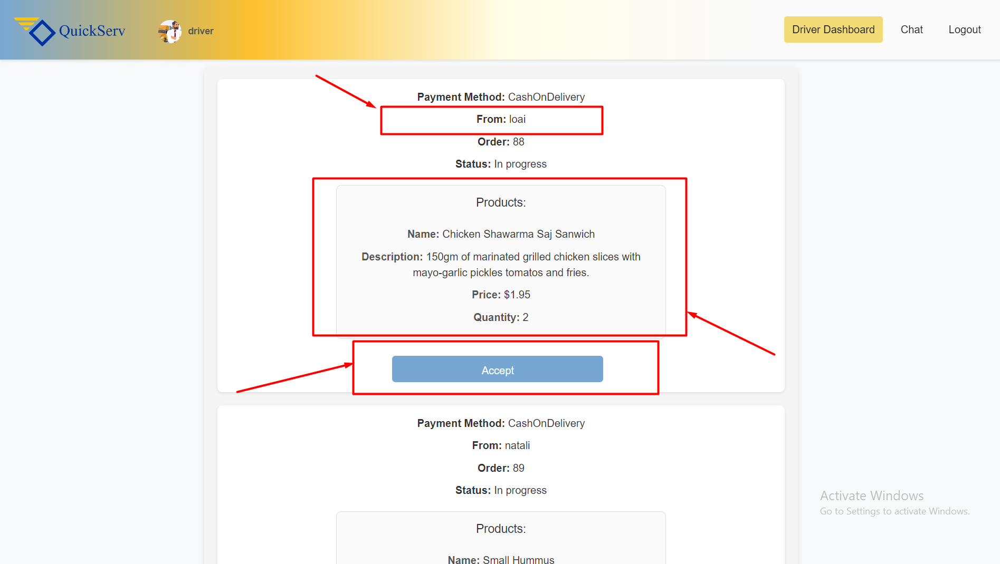
- On the **Owner Dashboard**, you can see how many products your shop has. You can edit or delete them, or add new products to your shop,or you can start chat with the admin.
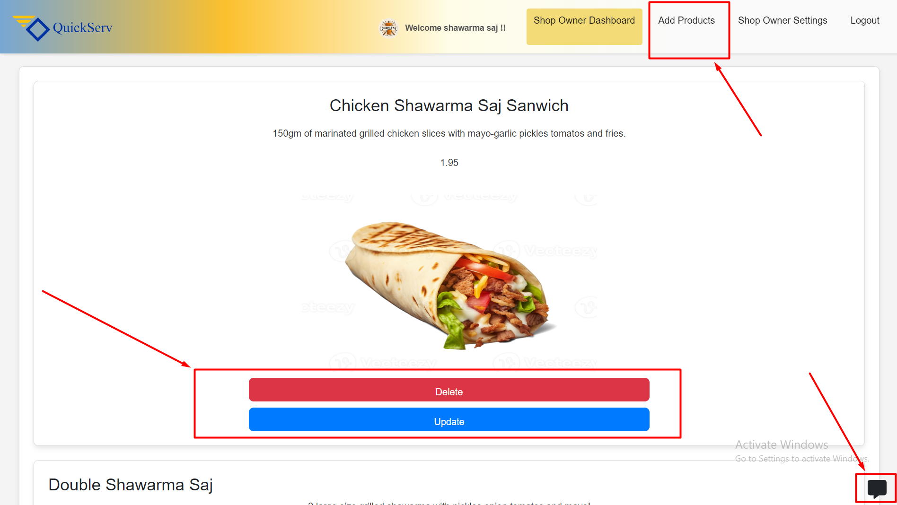
- On the **Admin Dashboard**, you can oversee all the products, categories, shops, users, reviews, orders, and drivers within the app or you can start chat with the a shop.
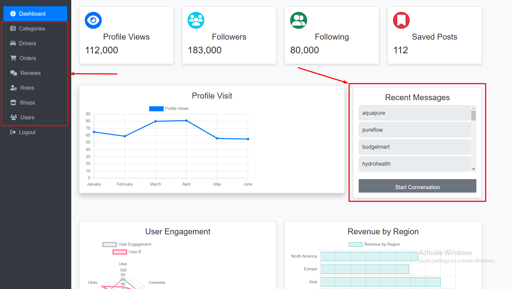

## ⛏️ Built Using <a name = "built_using"></a>

- [Neon](https://neon.tech/) - Database
- [Express JS](https://expressjs.com/) - Server Framework
- [React JS](https://reactjs.org/) - Web Framework
- [Node JS](https://nodejs.org/en/) - Server Environment

### Other Notable Dependencies

- [Axios](https://axios-http.com/) - HTTP Client for making requests
- [Bcryptjs](https://github.com/dcodeIO/bcrypt.js) - Library for hashing passwords
- [Cors](https://expressjs.com/en/resources/middleware/cors.html) - Middleware for enabling CORS
- [Dotenv](https://github.com/motdotla/dotenv) - Module for loading environment variables
- [Google Auth Library](https://github.com/googleapis/google-auth-library-nodejs) - OAuth2 Client for Google APIs
- [JSON Web Token](https://github.com/auth0/node-jsonwebtoken) - For signing and verifying tokens
- [PostgreSQL](https://www.postgresql.org/) (pg) - Database client for PostgreSQL
- [Socket.io](https://socket.io/) - Library for real-time communication
- [Twilio](https://www.twilio.com/) - Cloud communication platform
- [WS](https://github.com/websockets/ws) - WebSocket library for Node.js

### Frontend Libraries & Frameworks

- [Bootstrap](https://getbootstrap.com/) - CSS Framework for responsive design
- [Font Awesome](https://fontawesome.com/) - Icon library
  - `@fortawesome/fontawesome-free`
  - `@fortawesome/fontawesome-svg-core`
  - `@fortawesome/free-solid-svg-icons`
  - `@fortawesome/react-fontawesome`
- [Chart.js](https://www.chartjs.org/) & [React Chartjs 2](https://react-chartjs-2.js.org/) - For creating charts
- [Nivo](https://nivo.rocks/) - Data visualization library
  - `@nivo/pie`
- [PayPal JS](https://www.npmjs.com/package/@paypal/react-paypal-js) - PayPal integration for React
- [Redux Toolkit](https://redux-toolkit.js.org/) - State management
- [React Router](https://reactrouter.com/) - Routing library for React
- [React Toastify](https://fkhadra.github.io/react-toastify/) - Toast notifications for React
- [Victory](https://formidable.com/open-source/victory/) - Data visualization library for React
- [Recharts](https://recharts.org/) - Data visualization library for React
- [React-Modal](https://reactcommunity.org/react-modal/) - Accessible modal dialog component for React
- [React OnClickOutside](https://github.com/Pomax/react-onclickoutside) - Component for handling click outside events
- [React Rating Stars Component](https://github.com/awran5/react-rating-stars-component) - Rating stars component for React
- [React-Bootstrap](https://react-bootstrap.github.io/) - Bootstrap components built with React
- [Redux Persist](https://github.com/rt2zz/redux-persist) - Persist and rehydrate a redux store

### Testing

- [Testing Library](https://testing-library.com/docs/react-testing-library/intro/) - Testing utilities for React
  - `@testing-library/jest-dom`
  - `@testing-library/react`
  - `@testing-library/user-event`

### Additional Tools

- [EmailJS](https://www.emailjs.com/) - Email service integration
- [JWT Decode](https://github.com/auth0/jwt-decode) - Decode JWT tokens
- [MDB React UI Kit](https://mdbootstrap.com/docs/react/) - UI Kit for React
- [React Oauth Google](https://github.com/MomenSherif/react-oauth) - OAuth integration for Google in React
- [Web Vitals](https://web.dev/vitals/) - For measuring essential web vitals


## User Story <a name = "#user_story"></a>

Your trello board link
<a href='https://trello.com/b/UySdLoEL/techonomics'>Trello</a>

## Data Flow <a name = "#data_flow"></a>

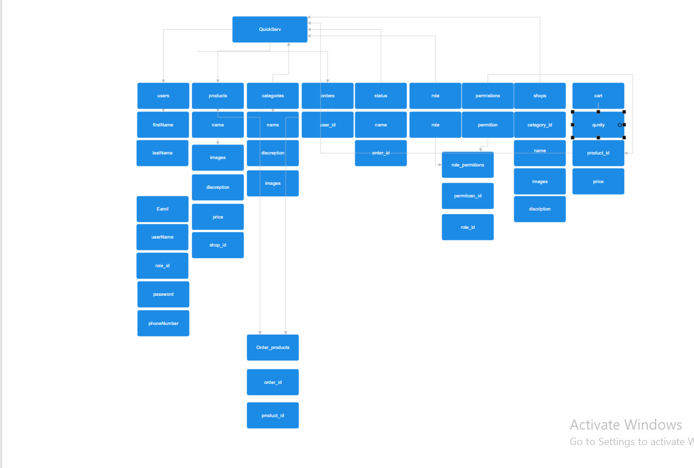

## ⚠️ Guided By <a name = "guided_by"></a>

This project is guided by ©️ **[MERAKI Academy](https://www.meraki-academy.org)**